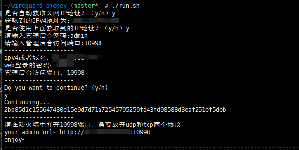

# Wireguard Easy
该项目可以帮助您在Docker中启动Wireguard VPN服务器，并提供简单的脚本来配置服务器参数。

# 安装要求
- Docker
- Bash Shell

# 使用方法
克隆该项目到本地：
```
git clone https://github.com/xubiaolin/wireguard-onekey.git
```

进入项目目录：`cd wireguard-onekey`
运行脚本：`./run.sh`

按照提示输入服务器参数：`IPv4`地址或域名、管理员密码等。
脚本会启动Wireguard VPN服务器，并将配置文件挂载到当前目录下的data/etc/wireguard中。

看到如下内容，则表示安装成功


# 注意事项
- 请确保所使用的IPv4地址或域名可以从公网访问到您的服务器。
- 管理员密码不可为空，否则脚本将退出。

本项目默认使用的Wireguard VPN服务器IP地址为10.0.8.x，默认DNS为223.5.5.5和223.6.6.6。
如需修改服务器参数，请修改脚本中的相关变量。

输入的端口，防火墙需要放开tcp和udp,同时请确保这些端口未被占用。


# 许可证
该项目使用MIT许可证，详情请参阅LICENSE文件。

# 风险声明

本项目仅供学习和研究使用，不鼓励用于商业用途。我们不对任何因使用本项目而导致的任何损失负责。

# 捐助和支持

如果觉得本项目对您有帮助，欢迎通过扫描下方赞赏码捐助项目 :)


